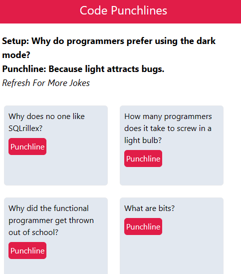

# Code punchlines?

Available at: 

## Project Overview:

Code Punchlines is a web for programming jokes to demonstrate (Tanstack) React-Query with Axios.

## Key Features:

Code Punchlines can:
Display Up to Ten Setups for Jokes.
Get the punchline for a joke
Refetch query. The query becomes stale after 1 minute and will auto-update if the screen loses and regains focus or route changes.

### API Used:

https://sv443.net/jokeapi/v2/

### Preview:

